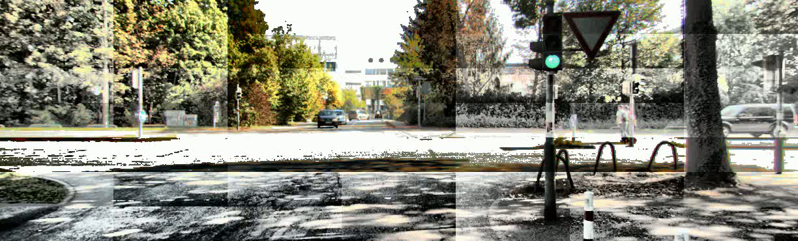

# Lane Detection and Turn Prediction
Lane detection algorithms are widely employed on vehicles to identify and track lanes on a road from images/video feed that is captured by mounted cameras. Lane detection is an important component of the Advanced Driver Assistance Systems (**ADAS**) suite in modern vehicles.

The goal of this project is to develop a simple lane detection algorithm that could be used to first detect lanes from a video feed and then track the detected lanes to predict the vehicle turn.

## Dependencies
This package was built using Python 3.7 on Ubuntu 20.04. OpenCV can be installed by following the instructions on . Other packages used include `scipy` and `matplotlib`, which are pretty easy to install using the `pip` package manager:
```
pip install <package_name>
``` 
Then, download the package using
```
git clone git@github.com:latent-pixel/LaneDetection.git
```
## 1. Histogram Equalization
To get a taste of the image preprocessing we might need when dealing with real-world data, we will first look at **Histogram Equalization** methods that are useful in "balancing" out image intensities. The goal is to make the image more visually appealing or suitable for further image processing tasks.

### Running the package
To run the package, use the following command:
```
python code/HistEqualization.py -i <input_file_path> -t <norm or adap> -s <save_path>
```
* Histogram type is either "*norm*" or "*adap*" for traditional histogram equalization and adaptive histogram equalization, respectively.

### Sample Output
Upon running the package, we get a `.avi` file which contains the histogram-equalized input.

Original             |  Traditional Histogram Equalization            |  Adaptive Histogram Equalization
:-------------------------:|:-------------------------:|:-------------------------:
  |    |  


## 2. Lane Detection
There are several approaches and algorithms for lane detection, each with its own strengths and limitations. For this project, we make use of the **Probabilistic Hough Transform** to tackle the problem.

### Running the package
To run the package, use the following command:
```
python code/LaneDetection.py -i <input_file_path> -s <save_path>
```
* Note that this is a relatively simple (classical) lane detection solution, you might have to play around with thresholding and Hough Transform parameters to get the desired output for another problem.

### Sample Output
Upon running the package, we get a `.avi` file which contains the frames with lane detection.


## 3. Turn Prediction
The goal is to detect curved lanes and predict the turn depending on the curvature: left or right. For this, we need compute the radius of curvature of the road by fitting a curve through the detected lane lines.

### Running the package
To run the package, use the following command:
```
python code/LaneDetection.py -i <input_file_path> -s <save_path>
```

### Sample Output
Upon running the package, we get a `.avi` file which contains the frames with lane detection.


*Figure 1 (Clockwise from top-left): Original frame, thresholded frame, Bird's eye view with curve fitting, Turn prediction with lane overlay.*

Sometimes, we face bad input frames with color and exposure issues, one such frame is shown below. To solve such problems, we use **weighted average** approach where the curve-fitting parameters that were historically stored weigh in heavily and predict the lane lines.


*Figure 2 (Clockwise from top-left): Original frame, thresholded frame, Bird's eye view with curve fitting - notice the problems with contrast, Turn prediction with lane overlay.*